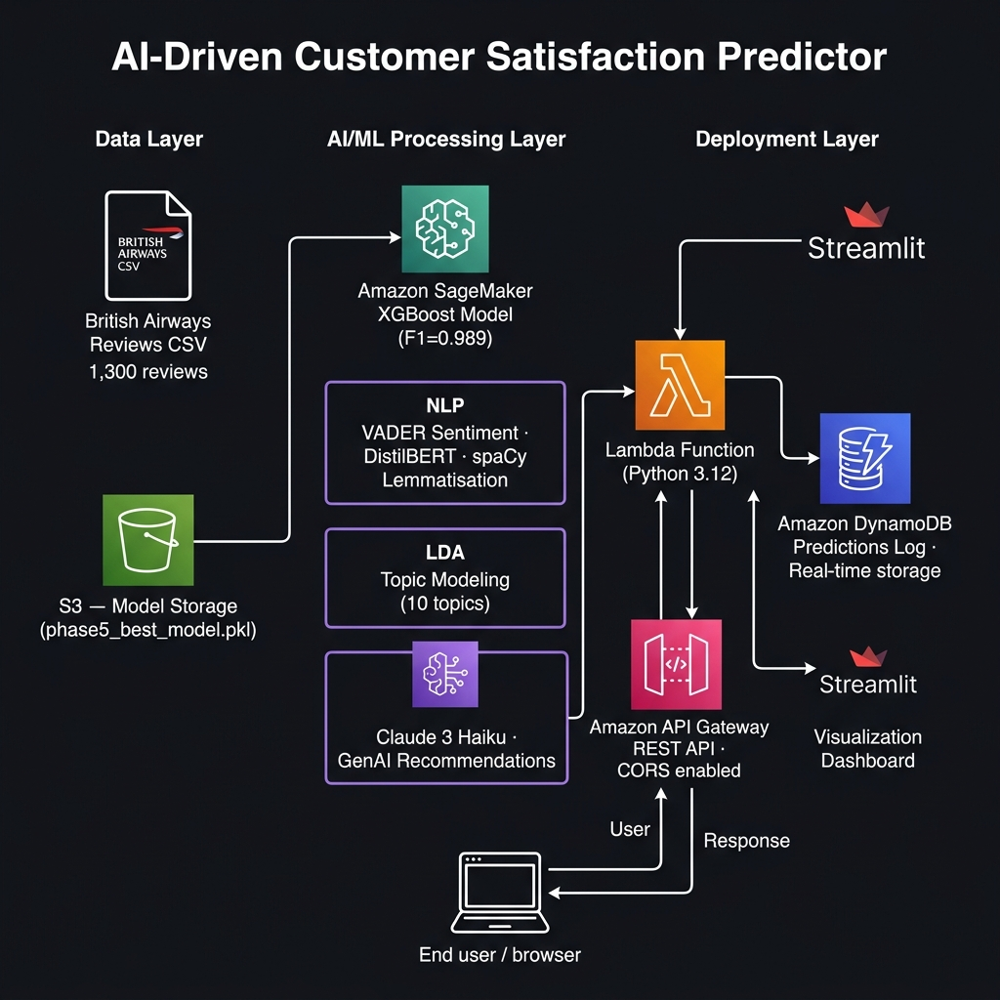

# ✈️ AI-Driven Predictive Customer Satisfaction Predictor

> **Predict British Airways customer satisfaction from review text — with VADER/DistilBERT sentiment analysis, XGBoost prediction (F1=0.989), LDA topic modelling, Amazon Bedrock GenAI recommendations, DynamoDB logging, S3 model storage, AWS Lambda API, and a Streamlit dashboard.**

---

## 🏗️ AWS Architecture



| Layer | AWS Service | Purpose |
|-------|------------|---------|
| Storage | **Amazon S3** | Model artifact storage (`phase5_best_model.pkl`) |
| Compute | **AWS Lambda** (Python 3.12) | Serverless inference API — 512 MB, 60s timeout |
| API | **Amazon API Gateway** | REST endpoint with CORS, `/predict` POST route |
| Database | **Amazon DynamoDB** | Real-time prediction logging (PAY_PER_REQUEST) |
| AI/ML | **XGBoost** | Satisfaction classification (F1=0.9885, AUC=0.9972) |
| NLP | **VADER + DistilBERT** | Sentiment analysis; VADER wins at F1=0.985 |
| Topic Modelling | **LDA (sklearn)** | 10 complaint categories from negative reviews |
| GenAI | **Amazon Bedrock (Claude 3 Haiku)** | Personalised recommendation generation |
| Dashboard | **Streamlit** | Real-time visualisation |

---

## 📁 Project Structure

```
.
├── 01_data_exploration_and_preprocessing.py   # Data cleaning, feature engineering, TF-IDF
├── 02_exploratory_data_analysis.py            # 12 EDA visualisations
├── 03_nlp_preprocessing_pipeline.py           # spaCy/NLTK tokenisation, lemmatisation
├── 04_sentiment_analysis.py                   # VADER vs DistilBERT comparison
├── 05_model_training.py                       # LR / RF / XGBoost / LightGBM baseline
├── 05_phase5_prediction.py                    # XGBoost on enriched features → phase5_best_model.pkl
├── 06_phase6_topic_modeling.py                # LDA on negative reviews (10 topics)
├── 07_phase7_recommendations.py               # Rule-based recommendation engine
├── bedrock_genai.py                           # Amazon Bedrock (Claude 3 Haiku) GenAI module
├── app.py                                     # Streamlit dashboard
├── architecture_diagram.png                   # AWS system architecture
│
├── deployment/
│   ├── lambda_function.py                     # AWS Lambda handler (S3 + Bedrock + DynamoDB)
│   ├── template.yaml                          # AWS SAM template (full infra-as-code)
│   └── requirements.txt                       # Lambda dependencies (boto3, xgboost…)
│
├── notebooks/                                 # Jupyter (.ipynb) versions of every script
├── data/                                      # Raw + processed CSV datasets
├── outputs/
│   ├── eda/                                   # 12 EDA charts
│   ├── sentiment/                             # 5 VADER vs DistilBERT charts
│   ├── models/                                # Model comparison charts + CSVs
│   └── topics/                                # Topic table + recommendation CSV
└── presentation/
    └── slides.md                              # 10-slide presentation (Markdown)
```

---

## 🧠 ML Pipeline

```
Raw Reviews (1,300 rows)
     │
     ▼
01 · Data Preprocessing      → british_airways_reviews_cleaned.csv
     │
     ▼
02 · EDA                     → 12 charts (eda_*.png)
     │
     ▼
03 · NLP Preprocessing       → cleaned_review (spaCy lemmatisation + stopwords)
     │
     ▼
04 · Sentiment Analysis      → VADER (winner F1=0.985) vs DistilBERT (F1=0.663)
     │
     ▼
05 · Model Training          → XGBoost best (F1=0.9885, AUC=0.9972)
     │                          phase5_best_model.pkl
     ▼
06 · Topic Modelling         → LDA, 10 topics on negative reviews
     │
     ▼
07 · Recommendations         → Rule-based engine (topic + sentiment → action)
     │
     ▼
🤖 · Amazon Bedrock GenAI    → Claude 3 Haiku personalised insight per review
```

---

## 📊 Model Performance

| Model | Accuracy | F1 | ROC-AUC | CV F1 |
|-------|----------|----|---------|-------|
| Logistic Regression | 80.0% | 0.799 | 0.855 | 0.777 |
| Random Forest | 95.0% | 0.950 | 0.997 | 0.959 |
| **XGBoost** ✅ | **98.9%** | **0.989** | **0.997** | **0.981** |
| LightGBM | 76.5% | 0.765 | 0.832 | 0.771 |

---

## 🖥️ Streamlit Dashboard

```bash
streamlit run app.py
```

**Features:**
- **🔍 Review Analyser tab** — Paste any review → live VADER score, XGBoost prediction, topic detection, rule-based recommendation
- **🤖 Amazon Bedrock GenAI** — Claude 3 Haiku generates a personalised, empathetic recommendation (toggle checkbox)
- **☁️ AWS infra status panel** — Shows Lambda / Bedrock / DynamoDB connection status
- **🏗️ Architecture tab** — Full AWS system diagram + service table

---

## 🤖 Amazon Bedrock GenAI

The `bedrock_genai.py` module calls **Claude 3 Haiku** via Amazon Bedrock Runtime:

```python
from bedrock_genai import generate_ai_recommendation

result = generate_ai_recommendation(
    review="The crew were rude and the flight was delayed 3 hours.",
    sentiment_label="Negative",
    sentiment_score=-0.769,
    satisfaction_label="Not Satisfied",
    topic="Cabin Crew & Staff Behaviour",
    confidence=1.0,
)
# result['ai_recommendation'] → personalised LLM-generated insight
# result['source'] → 'bedrock' | 'fallback'
```

Falls back gracefully to rich rule-based text if AWS credentials are not configured.

---

## 🗄️ DynamoDB — Prediction Logging

Every prediction (Streamlit or Lambda) is logged to `customer-satisfaction-predictions`:

| Attribute | Type | Example |
|-----------|------|---------|
| `prediction_id` | String (PK) | `"a1b2c3d4-..."` |
| `timestamp` | String (GSI) | `"2026-06-19T17:30:00Z"` |
| `review_snippet` | String | `"The crew were rude..."` |
| `sentiment_label` | String | `"Negative"` |
| `sentiment_score` | String | `"-0.7688"` |
| `predicted_satisfaction` | String | `"Not Satisfied"` |
| `confidence` | String | `"1.0"` |
| `detected_topic` | String | `"Cabin Crew & Staff Behaviour"` |
| `priority` | String | `"HIGH"` |

---

## ☁️ AWS Lambda Deployment

### Option A — AWS SAM (Recommended)

```bash
cd deployment

# Build Lambda package
sam build

# Deploy (first time — interactive)
sam deploy --guided

# Upload model to S3 (after SAM creates the bucket)
aws s3 cp ../phase5_best_model.pkl s3://ba-satisfaction-model-{your-account-id}/
```

**SAM creates:** Lambda + API Gateway + DynamoDB + S3 bucket + IAM role — all in one command.

### Option B — Manual ZIP Deployment

```bash
# Build Linux-compatible package
pip install -r deployment/requirements.txt -t ./package \
  --platform manylinux2014_x86_64 --only-binary=:all:

# Bundle
cp deployment/lambda_function.py phase5_best_model.pkl ./package/
cd package && zip -r9 ../lambda.zip . && cd ..

# Deploy
aws lambda update-function-code \
  --function-name customer-satisfaction-predictor \
  --zip-file fileb://lambda.zip
```

### Lambda Environment Variables

| Variable | Description | Example |
|----------|-------------|---------|
| `S3_BUCKET` | S3 bucket name for model | `ba-satisfaction-model-123456` |
| `S3_KEY` | S3 object key | `phase5_best_model.pkl` |
| `DYNAMO_TABLE` | DynamoDB table name | `customer-satisfaction-predictions` |
| `BEDROCK_MODEL` | Bedrock model ID | `anthropic.claude-3-haiku-20240307-v1:0` |
| `AWS_REGION` | AWS region | `us-east-1` |

**Lambda config:** Python 3.12 · 512 MB · 60s timeout

### API Request/Response

**POST** `https://{api-id}.execute-api.us-east-1.amazonaws.com/prod/predict`

```json
{ "review": "The crew were rude and the flight was delayed 3 hours." }
```

```json
{
  "sentiment_label": "Negative",
  "sentiment_score": -0.7688,
  "predicted_satisfaction": "Not Satisfied",
  "confidence": 1.0,
  "detected_topic": "Cabin Crew & Staff Behaviour",
  "recommendation": {
    "action": "Customer experience training program + crew feedback loop",
    "priority": "CRITICAL",
    "owner": "HR & Inflight Services",
    "kpi": "Crew satisfaction score, complaint-per-flight rate"
  },
  "ai_recommendation": "We sincerely apologise for the unprofessional experience...",
  "genai_source": "bedrock"
}
```

---

## 🔍 Topic Categories (Negative Reviews)

| Topic | Reviews | Priority |
|-------|---------|----------|
| Seat Comfort & Legroom | 218 | MEDIUM |
| Flight Delays & Punctuality | 148 | HIGH |
| Flight Cancellations | 134 | CRITICAL |
| Cabin Crew & Staff Behaviour | 48 | HIGH |
| Baggage & Luggage | 23 | HIGH |
| Food & Catering Quality | — | MEDIUM |
| Check-in & Boarding Process | — | MEDIUM |
| Customer Service & Support | — | HIGH |
| Refunds & Compensation | — | HIGH |
| Airport Lounge Experience | — | LOW |

---

## ⚙️ Local Setup

```bash
# Install dependencies
pip install pandas numpy scikit-learn xgboost lightgbm \
            nltk spacy vaderSentiment streamlit scipy boto3

# Download spaCy model
python -m spacy download en_core_web_sm

# Download NLTK data
python -c "import nltk; nltk.download(['stopwords','wordnet','omw-1.4'])"

# Run full pipeline (in order)
python 01_data_exploration_and_preprocessing.py
python 02_exploratory_data_analysis.py
python 03_nlp_preprocessing_pipeline.py
python 04_sentiment_analysis.py
python 05_phase5_prediction.py
python 06_phase6_topic_modeling.py
python 07_phase7_recommendations.py

# Launch dashboard
streamlit run app.py
```

---

## 🛠️ Tech Stack

| Layer | Tools |
|-------|-------|
| Language | Python 3.12 |
| NLP | NLTK · spaCy · VADER · DistilBERT |
| ML | scikit-learn · XGBoost · LightGBM |
| Topic Modelling | LDA (sklearn) |
| GenAI | Amazon Bedrock (Claude 3 Haiku) |
| Cloud Compute | AWS Lambda |
| API | Amazon API Gateway |
| Database | Amazon DynamoDB |
| Storage | Amazon S3 |
| IaC | AWS SAM (template.yaml) |
| Dashboard | Streamlit |
| Data | pandas · numpy · scipy |

---

## 📄 Dataset

British Airways customer reviews — 1,300 rows · columns: `title`, `reviews`
Source: Publicly available airline review dataset.
